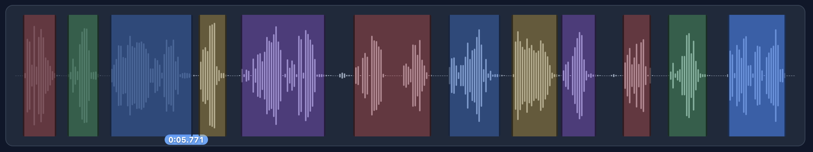
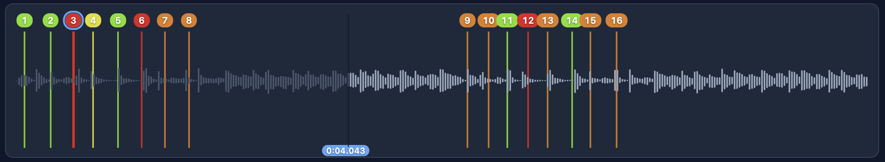

# AudioSplit

**Browser-based tools for slicing and mapping audio.** Everything runs entirely in your browser using the Web Audio API — your files never leave your machine, and there's no server or upload involved.

AudioSplit bundles two tools behind a simple landing page:

| Tool | What it does |
| --- | --- |
| **VoiceSplit** | Auto-segments spoken-word audio (e.g. voice recordings) and exports the segment timings as JSON. |
| **MusicSplit** | Analyzes music for rhythmic variation and authors Beat Saber–style boxing/punch maps. |

---

## VoiceSplit



Drop in an audio file and VoiceSplit automatically finds the spoken segments by detecting where sound rises above the background noise floor.

**How it works:**
1. The file is decoded with the Web Audio API and down-mixed to mono.
2. A short-time **RMS energy** envelope is computed (20 ms window, 10 ms hop).
3. A noise floor is estimated from the quietest frames (10th percentile), and anything that rises above a multiple of that floor is treated as "voiced."
4. Adjacent runs are merged across small gaps, very short blips are dropped, and each segment is padded slightly for clean edges.

You can then **play back**, **add/remove segments manually**, fine-tune their boundaries on the waveform, and **export** to JSON:

```json
[
  [0.000, 1.250],
  [2.100, 0.890]
]
```

Each entry is `[startSeconds, lengthSeconds]`, sorted by start time.

---

## MusicSplit



Drop in a song and MusicSplit detects rhythmic events ("punches") and lets you turn them into a playable **Beat Saber** map — styled for boxing-type, any-direction punches.

**How it works:**
1. The audio is down-mixed to mono and downsampled to 22.05 kHz for analysis.
2. A spectral **novelty / onset** function is computed (1024-sample window, 512 hop) to find moments of change.
3. Peaks are picked as punch candidates (minimum 250 ms apart) and an estimated BPM is derived.
4. Each punch is assigned a "type" that maps to a fixed position on the Beat Saber 4×3 note grid and a hand (red/left, blue/right).

**Exports:**
- **JSON** — a simple list of punches (`{ i, t_sec, type }`) with the song name and count.
- **Beat Saber map (`.zip`)** — a ready-to-use level folder containing `Info.dat`, an `ExpertPlusStandard.dat` beatmap (v3.3.0), a placeholder cover, and a `README.txt`. Add your own `song.ogg` (instructions included in the zip) and drop the folder into your Beat Saber `CustomLevels` directory.

---

## Tech stack

- **[React 18](https://react.dev/)** + **[React Router](https://reactrouter.com/)** — UI and routing
- **[Vite](https://vitejs.dev/)** — dev server and build
- **TypeScript**
- **[wavesurfer.js](https://wavesurfer.xyz/)** — waveform rendering and playback
- **[JSZip](https://stuk.github.io/jszip/)** — building the Beat Saber map archive
- **Web Audio API** — all decoding and analysis (100% client-side)

---

## Getting started

### Quick launch (macOS)

The easiest way to run AudioSplit locally:

1. **Double-click `AudioSplit.command`.** It selects a compatible Node version (via nvm), installs dependencies on first run, starts the dev server in the background, opens your browser at `http://localhost:5173`, and then closes its own Terminal window.
2. **Double-click `Stop AudioSplit.command`** when you're done, to stop the background server.

> **First run:** macOS Gatekeeper may block the scripts — right-click → **Open** once per file. The first auto-close may also prompt *"Terminal wants to control Terminal"*; click **OK** to allow it.

### Manual (any platform)

Requires **Node ≥ 18** (Node 22 recommended; see `.nvmrc`).

```bash
# Install dependencies
npm install

# Start the dev server
npm run dev

# Build for production
npm run build

# Preview the production build
npm run preview
```

Then open the URL Vite prints (`http://localhost:5173`) and pick a tool from the landing page.

---

## Project structure

```
AudioSplit.command          # One-click launcher (start server + open browser)
Stop AudioSplit.command     # Stops the background dev server
.nvmrc                      # Pins Node version (22)
src/
├── App.tsx                 # Routes: / (landing), /voice, /music
├── pages/
│   ├── LandingPage.tsx     # Tool picker
│   ├── VoicePage.tsx       # VoiceSplit UI
│   └── MusicPage.tsx       # MusicSplit UI
├── components/
│   ├── FileDropZone.tsx    # Drag-and-drop file input
│   ├── Toolbar.tsx         # Play / add / remove / export controls
│   └── WaveformView.tsx    # wavesurfer-based waveform + segment overlays
└── lib/
    ├── audio.ts            # Decode, down-mix, RMS energy
    ├── segmenter.ts        # VoiceSplit segmentation
    ├── musicAnalysis.ts    # MusicSplit onset/novelty analysis
    ├── beatsaber.ts        # Beat Saber map + JSON export
    └── types.ts            # Shared types
```

---

## Notes

- All processing happens locally in the browser — **no audio is uploaded anywhere**.
- Beat Saber requires the song as **Ogg Vorbis (`.ogg`)**; the exported zip includes a one-line `ffmpeg` command to convert your audio.
